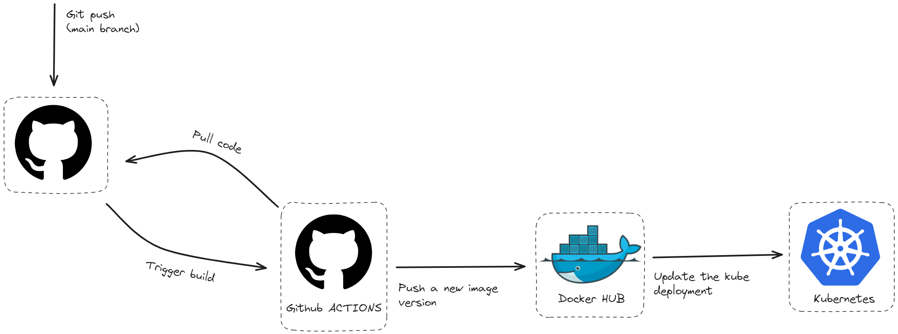

# Guma

// screenshots

## 🖖 What is Guma ?

If you are a League of legends fan you already know [Gumayusi](https://en.wikipedia.org/wiki/Gumayusi) but if you don't He is a League of Legends esports player, currently bot laner for T1 and 2023 LOL world champion. My fav player.

### In this context

Guma is a Lightweight and Self Hosted project management app highly inspired by [Linear](https://linear.app/), [Plane](https://plane.so/) and [Jira](https://www.atlassian.com/fr/software/jira) that allows to manage multiple projects.

### 🚨Warning 🚨
I built Guma to apply things i have learned about building microservices. I will use it for my own  (to track my projects) so if you trust me enough you can use the version hosted on my server but if you don't you can self-host the project on your own infrastructure.  

I will keep improving the code base by adding new features or new practices i will learn in the feature. 

## 🚀 Features 
Guma provides the features below: 

- **Issues:** Track and manage all tasks, bugs, and feature requests. Create, assign, prioritize, and monitor issues. 
- **Sprints:** Implement Agile methodologies by organizing work into time-boxed sprints. Plan, track, and review sprint progress. 
- **Documents:**
- **Modules:** Organize and manage different project components or functional areas. Break down projects into manageable parts to maintain focus and alignment.
- **Dashboard:** Get a comprehensive overview of project status and key metrics.

## 🛠️ Overall architecture

### Services

> **Note: Each project in the monorepo contains its own architecture details which you can refer to.**

Name	| Path	| Stack	|  Description  |
------------- | -------------------- | ------------- | ----------- |
Frontend	| [/frontend](/frontend)	| [React](https://react.dev/)  |  The frontend app	|  |
Gateway	| [/gateway](/gateway)	| [Nestjs](https://nestjs.com/)  |  Gateway built with GraphQL Federeration	|  | 	
Identity	| [/backend-services/users](/backend-services/users)	| [Spring Boot](https://spring.io/projects/spring-boot) |  Service responsible of auth and users handling	|
Project	| [/backend-services/project](/backend-services/organization)	| [Spring Boot](https://spring.io/projects/spring-boot) | Service responsible for project handling	|
Team	| [/backend-services/team](/backend-services/team)	| [NestJS](https://nestjs.com/) |  Service responsible for team, workflow and members     handling	|
Issues	| [/backend-services/issues](/backend-services/issues)	| [NestJS](https://nestjs.com/) |  Service responsible for handling everything related to tasks, sprints, reminders etc.	|
Wiki	| [/backend-services/wiki](/backend-services/wiki/)	| [NestJS](https://nestjs.com/) |  Service responsible of the wiki part document handling	|
Notification	| [/backend-services/notifications](/backend-services)	| [Go](https://go.dev/)  | Service responsible for sending notifications (Push and email)	| 
Data-Access	| [/backend-services/data-access/](/backend-services/data-access)	| [Go](https://go.dev/) |  Service connected to the database and responsible of exposing a REST api	|

>We have implemented an anti-pattern here by having only one service connected to the database, all the services need to communicate with that data-access service in order to retrieve the data they need, it has created a [single point of failure](https://www.techtarget.com/searchdatacenter/definition/Single-point-of-failure-SPOF#:~:text=A%20single%20point%20of%20failure%20(SPOF)%20is%20a%20potential%20risk,entire%20system%20to%20stop%20operating.) that we need to fix. 

### External services
The system uses external services

Name	| Role	|  Description  |
------------- | ------------ | ----------- |
[PostgreSQL](https://www.postgresql.org/)	| Database |  The database for the app	|
[Redis](https://redis.io/fr/)	| Cache	|   Caching system (in progress)	|
| [RabbitMQ](https://www.rabbitmq.com/) | Messaging | For messaging between services

## 👀 Observability 
Observability refers to the ability to understand, measure, and gain insights into the internal state and behavior of a system based on its external outputs. 
For this project we have setup traces, logs and metrics. The schema below shows the tools we have used. 

Name	| Role	|
------------- | ------------ |
[Promtail](https://grafana.com/docs/loki/latest/send-data/promtail/)	| The agent responsible for collecting the logs from the service |
[Loki](https://grafana.com/oss/loki/)	| Store the logs forwarded by Promtail	| 
| [OpenTelemetry](https://opentelemetry.io/) | Responsible for collecting traces and metrics |
| [Tempo](https://grafana.com/oss/tempo/) | Store the traces |
| [Prometheus](https://prometheus.io/) | Store the metrics | 
| [Grafana](https://grafana.com/grafana/dashboards/) | Dashboard to visualize all logs, traces and metrics |

## 👨‍🔧Infrastructure
Our application infrastructure leverages [Kubernetes](https://kubernetes.io/) to manage and orchestrate all microservices within the same repository. Kubernetes (K8s) is an open-source platform designed to automate deploying, scaling, and operating application containers. By utilizing Kubernetes, we ensure that our microservices are highly available, scalable, and resilient.

All Kubernetes manifests required to deploy and manage our services are located in the k8s directory of this repository. This directory contains the necessary YAML files to define the desired state of our application components, including:

- Deployments
- Services
- ConfigMaps
- Ingress

For now each resource is manually created, infra automation will be added using tools like [Terraform](https://www.terraform.io/) or [Pulumni](https://www.pulumi.com/). 

## Deployment
Deploying microservices, with their interdependence, is much more complex process than deploying a monolithic application. It is really important to have a fully automated infrastructure. We can achieve following benefits with Continuous Delivery approach:

- The ability to release software anytime
- Any build could end up being a release
- Build artifacts once - deploy as needed

Here is a simple Continuous Delivery workflow, implemented in this project:

In this [configuration](/.github/workflows/), Github Actions builds tagged images for each successful git push in the main branch. So, there are always the latest images for each microservice on [Docker Hub](https://hub.docker.com/) and older images, tagged with git commit hash. It's easy to deploy any of them and quickly rollback, if needed. 
Once the image has been built and deployed to the registry the job will connect to the server to update the image version used by the [Kubernetes Deployment](https://kubernetes.io/docs/concepts/workloads/controllers/deployment/). I know there is no [ArgoCD](https://argo-cd.readthedocs.io/en/stable/) here but i will definitely add it at some point. 

## Demo

## License 
The tool is available as open source under the terms of the [MIT License](https://opensource.org/license/MIT)

## Built by

- Marius Vincent NIEMET [Twitter](https://twitter.com/mariusniemet05) [LinkedIn](https://www.linkedin.com/in/marius-vincent-niemet-928b48182/) 

